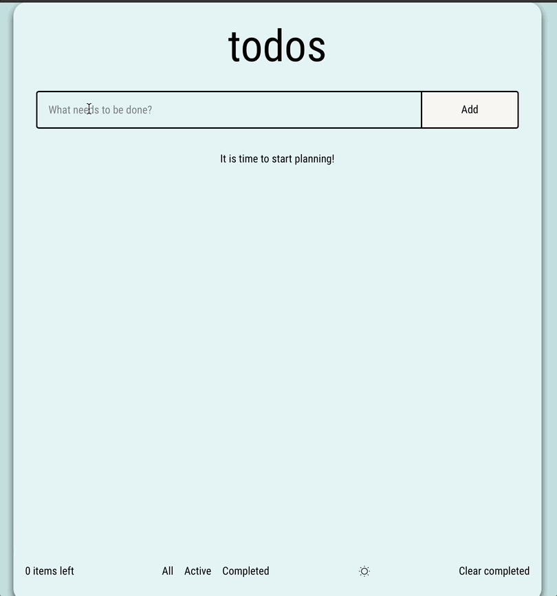

# todos
## [Сайт](https://romanmitaki.github.io/todos/)
## Описание
Тестовое задание Mindbox (frontend-junior). 
ToDo-приложение, позволяющее управлять текущим списком дел.
[Здесь] расположено само задание.
## Функиональность
-  возможность добавления задач; 
-  задача может быть помечена как выполненная; 
-  отображение задач можно фильтровать (все, только активные, только выполненные);
-  возможно удалить любую задачу, а также сразу все задачи, помеченные как выполненные;
-  задачу можно редактировать;
-  возможность выбора темы;
-  состояние приложения (задачи и выбранная тема) сохраняются в localStorage.
## Технологии
Приложение создано с использованием Webpack (сконфигурирован самостоятельно). При написании кода применялись линтеры и юнит-тесты.
Перечень:
- React.js;
- TypeScript;
- ESLint;
- Stylelint;
- Jest;
- React Test Library.
## Установка
1. Клонировать репозиторий git clone git@github.com:RomanMitaki/todos.git.
2. Установить зависимости с помощью npm install.
3. Запустить проект npm run start.

